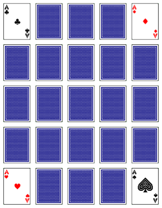
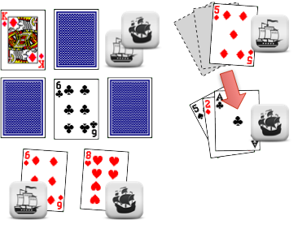
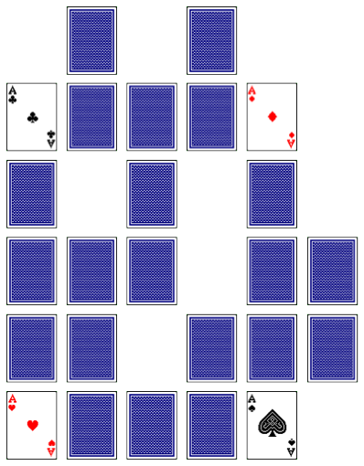

*version 1.0.0*



* This will become a table of contents
{:toc}

# Setting up

All you need is a standard deck of cards, and a makeshift counter of some sort for each player. Use a deck of cards with blue backs for added theme, and little pirate ships if you can find some!

Find a space on the ground or a table. Take your pack of cards, remove the Aces and place them to one side.

Lay out 36 cards face down in a 6 x 6 rectangle. This rectangle represents *the high seas*. There are four *islands* on the sea, represented at by the four Aces. Place each of these face up on each corner of the rectangle, one in from the edge, like this:

Place each player's counter on one island on the sea - this represents their *ship*. In two player games put the players on diagonally opposite islands.

Deal the remaining cards to the players. In 2 player games each player should have 6 cards, in 3 player games each should have 4 cards and in 4 player games each will have 3 cards.

Cards in a players hand have different uses. The number cards are *crew cards* and can be used to sail the ship and to fight battles. The Jack and Queen cards are new *first mates* you've recruited - they have a treasure map you can used to recover treasure on an island. The Kings represent *island governors* - you can sail them back to their island for a reward. The Aces represent *treasure*.

# Aim

The player who scores the most points in hand wins at the game end. Points are gained through recruiting first mates, meeting island governors and finding treasure.

# Starting the game

Decide who starts by mutual consent. Play continues clockwise in turns. During a turn a player may choose to either *sail*, or *drift* if they have no crew cards.

# Sailing

To sail your ship, choose any crew card (number card) from your hand. Place the card face up underneath the island card.

This gives you as many *sailing points* to sail that turn as the number on the card. You don't have to use all your points, but any extra points are wasted.

It costs 3 sailing points to sail to an adjacent square, and 5 points to sail diagonally.

You may only change direction once during your turn, you cannot sail into the same square twice in the same turn and you cannot finish on the square you started on.

In subsequent turns, in order to sail from any sea or island square, place the chosen crew card face up on the square your ship is on before moving.

## "Heave to!"

When coming to rest on a sea square, pick up any cards on that square and add them to your hand.

If you choose to sail onto an island space, you must end your turn there. Pick up any cards underneath the face up card (but not the face up card itself.)

If you have landed on another player ship, resolve the attack (see below. After this, your turn is over, and play passes to the left.

## Sailing example

*In this case the player has crew cards of 5 and 6 in his hand. They can choose to either use the 5 or 6 crew card to move directly north, or north east to the island, or use the 6 to move two squares east.*

*The player chooses to move North East to the island, and uses their 5 crew card to do so. Because they have moved from a sea square, they place the card face up on the square they have moved from. The player then picks up any cards below the face up ace card - in this case a 10.*

*When moving next turn, the player will only have to show the other players a crew card rather than place one, as they are now on an island square.*

## Drifting

If you have no crew cards for whatever reason, you have the option of drifting one square without having to place a card. Resolve the rest of your turn in the same way as for *sailing* above.

## Storms

As the game progresses, occasionally spaces may appear without cards on them. These represent fearful storms drifting across the sea. If you sail to a square without any card on it, you must end your turn there and place a crew card face up to represent crew lost during the squall.



# Discovering treasure and island politics

If, when landing on an island, you have a face card in your hand *of the same suit* as an ace or higher face card on the island you have landed on, you may exchange the cards and place the higher card in your hand.

You can only perform this exchange when first landing on the island, and you may not take a lower card in exchange for a higher one.

These exchanges might represent the following plot lines:

- *Queen/Jack replaces Ace:* Your first mate finds buried treasure using an old map. Take the ace card and add it to your hand.
- *King replaces Ace:* In return for rescuing you from kidnappers, the Governor gives you a handsome reward.
- *Jack replaces King:* The long lost son of the Governor has been found! You take the King card to represent the Governor's thanks and allegiance.
- *Queen replaces King:* The Governor falls in love with the beautiful pirate maiden and agrees to marry her. You take the King card to represent the Governor's friendship and allegiance.
- *Jack replaces Queen:* Tired of boring island life, the Governor's daughter runs away to join your pirate crew.

Alternatively, you can have fun making up your own stories! Let us know if you come up with any good ones.

## Searching for treasure example

*This ship has just moved onto the island. The player has a Queen card in his hand so is able to dig for buried treasure...*

*The player swaps the Ace card for the Queen and adds it to his hand.*

# Attacking other ships

To attack another ship, sail onto the sea square it occupies. Ships on islands are immune from attack - you can sail onto the same island square, but the attack is not resolved. If you sail to a square with more than one ship, you choose which ship you attack.

To attack, pick a crew card from your hand and place it face down in front of you. The defender does the same, and both cards are revealed together. The player with the highest card is the winner.

If you don't have a crew card to place as a defender, you can choose not to place a card. In this case the attacker automatically wins.

The cards used in the attack and defence are lost as casualties. They are placed face up on the island which matches their suits underneath the island card on top. The winner then gets to select two card at random from the loser's hand and places it in his own hand. The winner then gives the loser one card of their choosing.

If there is a draw, first the attacker selects a two cards from the defenders hand and then the defender selects two cards from the attackers hand (not including the cards the attacker just drew).

## Attacking example

*In this example, the black ship uses a 6 crew card to move diagonally onto the same square as the white ship. Both players choose a card and place it face down in front of them.*

*The white player chooses a 6 and the black player chooses an 8, so the black ship is the winner. The black player chooses a card at random from the white player's remaining hand of 2, and luckily chooses the Ace: they have stolen the treasure from the white ship!*

*The crew cards used in the battle are lost as casualties and are sent to the nearest island, two squares due west. They will be recruited as fresh crew next time another ship lands on the island.*

# Game end

The game ends when all treasure has been reclaimed (all Aces are replaced by face cards.) As soon as the last treasure is found, all the hands are shown face up. The person with the highest scoring cards is the winner.

The cards are worth the following points at game end:

- Ace: 3
- King: 2
- Queen: 1
- Jack: 1
- Crew cards: 0

If there is a tie, the person with the most Aces wins, followed by the most Kings, etc.

# Variants

The following variants haven't been as well tested as the main game: but do try them and let me know what you think of them!

## Variant: Hidden cards

Whenever you place a crew card down on the sea or island, show the card to the other players, but place it face down rather than up. This makes for a tougher game, more reliant on memory.

## Variant: Treacherous seas

During the set up of the game, each player takes a card of their choice from the middle and places it around the edge of the map without looking at it, like this:

The gaps in the map are *storms* (see above) and cannot be navigated without stopping and placing a card down.

## Variant: Burying treasure

When placing a card face up to sail from an island or sea space, you have the additional option of placing any number of any type of card face down beneath the face up card. These cards are then picked up by any player which sails to that square in future.

You can use this to bury treasure to retrieve later, or leave useless cards as a decoy! This variant adds more strategy at the risk of making the game a bit more complex.
